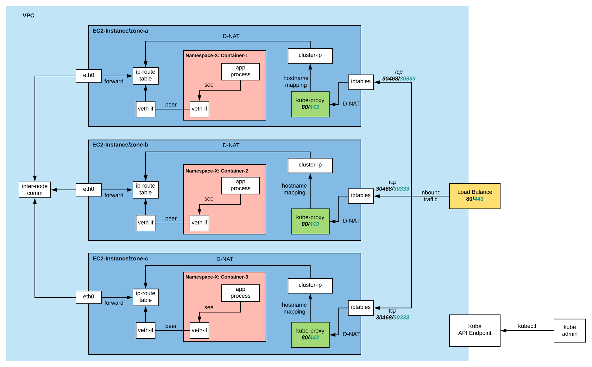

This page presents networking perspective of EKS.

## MODEL

## Load Balancer (LB)
The internet-facing LB takes inbound traffic and distributes them among three EC2 nodes which lie in different availability zone (a,b,c)

## Iptables
Each node performs its internal redirection of traffic using iptables. Based on input address or hostname, respective routing will be done so the traffic can reach the right container within node.

Traffic will go through kube-proxy which is an nginx container. Essentially it does dns-name based routing.

Each Service has its own cluster-ip (10.100.*) . This IP will then be DNAT translated to subnet of EC2 nodes.

## Ip-route
After traffic is filtered and redirected in early phase, it continues its flow with ip-route which determine location of service in that node or other nodes.

Each EC2 node communicates with each other through eth0 interface.

## Container
To let the traffic reach application inside container, a [VETH](http://man7.org/linux/man-pages/man4/veth.4.html) peer connection is established between host node and container. This connection create communication between namespaces. 

The ip address which application inside a container listens at cannot be seen from host node as they have different namespaces. These IPs are reflected as secondary IP address of EC2 instance.

## Kube API endpoint
Power user fully control operation of entire cluster via API endpoint.
