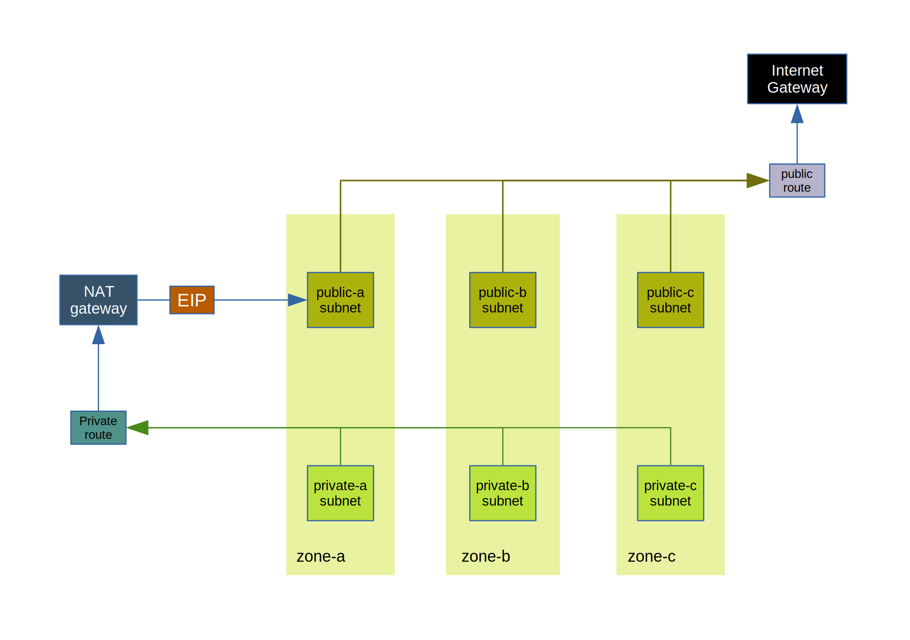

This page present standard VPC layout on AWS cloud

### 0 Model



- Preferred octet: 35
- Sample subnet ranges (vpc = 10.35.0.0/16):
* public-a:  10.35.0.0/20
* public-b:  10.35.16.0/20
* public-c:  10.35.32.0/20
* private-a: 10.35.64.0/20
* private-b: 10.35.128.0/20
* private-c: 10.35.144.0/20


### 1 EDIT INPUT
* ```INPUT-SET```:
``
OCTET: preferred 2nd octet in IP address
PREFIX: added to vpc naming convention as namespace
```
* ```TF_VARS```:
Environment variables for Terraform client
```
AWS_DEFAULT_REGION: aws region
AWS_ACCESS_KEY_ID: key id
AWS_SECRET_ACCESS_KEY: secret key
```


### 2 PLAN AND BUILD
* Plan:
```
make vpc
```
* Build:
```
make vpc CMD=apply
```


### 3 DESTROY
```
make destroy
```

