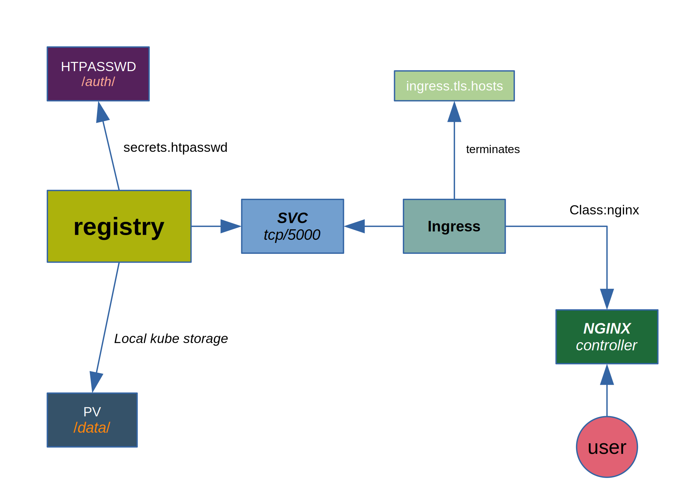

This page present registry deployment atop kube cluster

### 0 Model


### 1 EDIT ```INPUT-SET```
* PREFIX: helm prefix
* NAMESPACE: kube namespace
* BASE64_TLS_CRT: certificate in base64 format
* BASE64_TLS_KEY: key

### 2 PERSISTENCE VOLUME
Create data dir in each kube node:
```bash
prefix=$1
sudo mkdir -p  /data/${prefix}/{0,1,2}
sudo chgrp -R microk8s /data/${prefix}
sudo chmod -R 770 /data/${prefix}
```


### 2 DEPLOY
```bash
make registry
```


### 3 ADD USER TO REGISTRY
```bash
make user  USER=  PASS=
```

### 4 REMOVE REGISTRY
```bash
make clean
```

