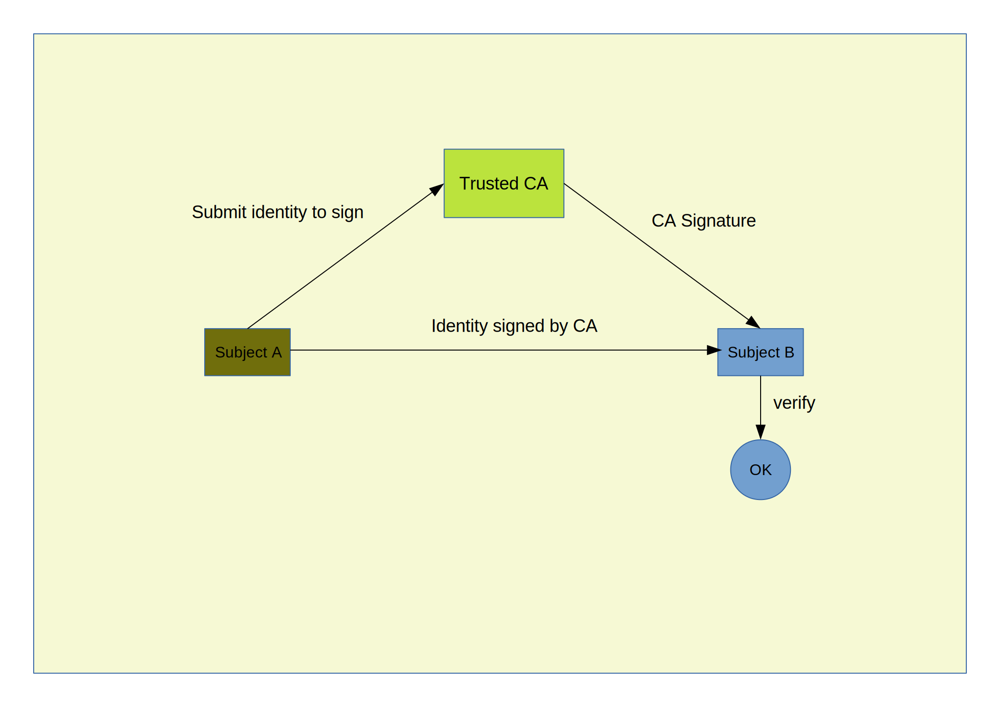

# PKI-SELF: A PKI by yourself



### 0 Edit your ```INPUT-SET.mk```
* ISSUER: name of CA
* SUBJECT: name of person who request his identity to be certified by ISSUER 
* ORG_NAME: name of organization which subject belong to
* EXTENSION: usage of identity certificate ( "standard" , "server")

### 1 Create your own certificate authority/issuer
```
bash> make ca
```

### 2 Create your identity
```
bash> make csr
```

### 3 Issuer signs your identity
```
bash> make ca-signing
```

### 4 Export identity for external usage
```
bash> make subject-export
```
