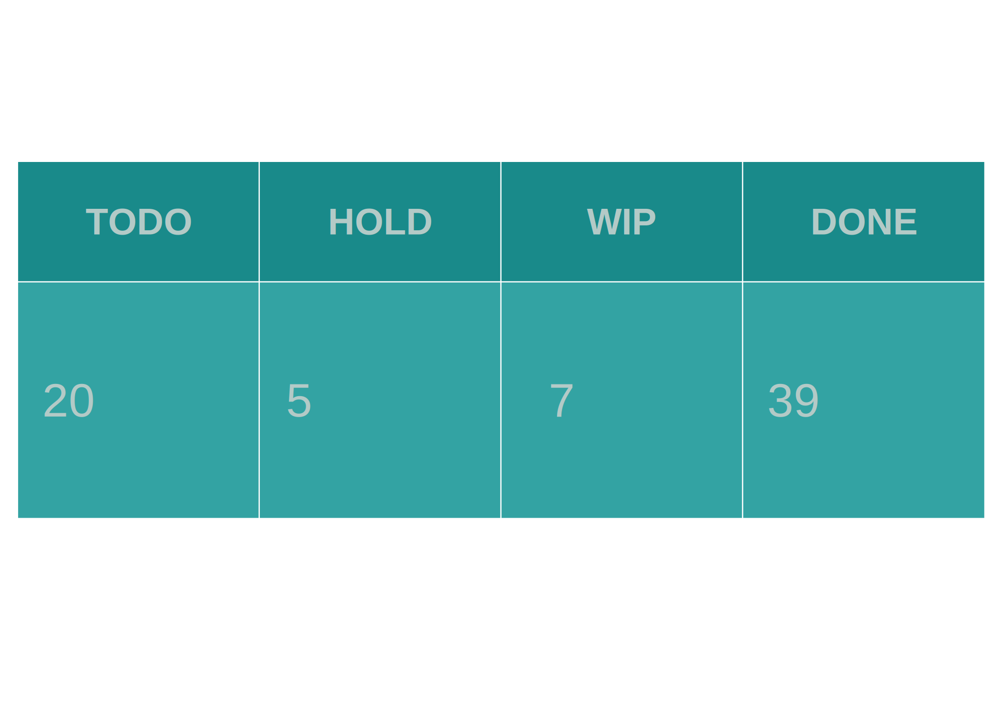

### 0 MODEL: KANBAN



### 1 WORK IN PROGRESS

- [datum/2025/WIP/KITE-12.md](datum/2025/WIP/KITE-12.md)   ```# MongoDB : Atlas```
- [datum/2025/WIP/KITE-14.md](datum/2025/WIP/KITE-14.md)   ```# Docker : hub```
- [datum/2025/WIP/KITE-15.md](datum/2025/WIP/KITE-15.md)   ```# Slack : workspace```
- [datum/2025/WIP/KITE-8.md](datum/2025/WIP/KITE-8.md)   ```# Openshift :```
- [datum/2025/WIP/MDOS-14.md](datum/2025/WIP/MDOS-14.md)   ```# Makefile: command
```
- [datum/2025/WIP/MDOS-2.md](datum/2025/WIP/MDOS-2.md)   ```# toolset : build/compile```

### 2 ON HOLD

- [datum/2025/HOLD/KUBEX-3.md](datum/2025/HOLD/KUBEX-3.md)   ```# ISSUE : log query dashboard```
- [datum/2025/HOLD/KUBEX-5.md](datum/2025/HOLD/KUBEX-5.md)   ```# jaeger : tracing system```
- [datum/2025/HOLD/LEAF-31.md](datum/2025/HOLD/LEAF-31.md)   ```# Workstation platform : components```
- [datum/2025/HOLD/NJS-2.md](datum/2025/HOLD/NJS-2.md)   ```# GLORIA: run objectory```
- [datum/2025/HOLD/VIM-4.md](datum/2025/HOLD/VIM-4.md)   ```# rc : container x-ray```

### 3 TO DO

- [datum/2025/TODO/ADOBE-1.md](datum/2025/TODO/ADOBE-1.md)   ```# colorhunt.co : preset download```
- [datum/2025/TODO/CMW-2.md](datum/2025/TODO/CMW-2.md)   ```# commonwealth : vault function```
- [datum/2025/TODO/DTUM-2.md](datum/2025/TODO/DTUM-2.md)   ```# pedrive : physical extended drives```
- [datum/2025/TODO/KITE-13.md](datum/2025/TODO/KITE-13.md)   ```# sops : env```
- [datum/2025/TODO/KITE-16.md](datum/2025/TODO/KITE-16.md)   ```# Chrome : box```
- [datum/2025/TODO/KROS-5.md](datum/2025/TODO/KROS-5.md)   ```#  :```
- [datum/2025/TODO/LEAF-13.md](datum/2025/TODO/LEAF-13.md)   ```# Clipboard: internode```
- [datum/2025/TODO/LEAF-30.md](datum/2025/TODO/LEAF-30.md)   ```# Jupyter :```

### 4 DONE

- [datum/2025/DONE/APLE-1.md](datum/2025/DONE/APLE-1.md)   ```# apple-bit : application explorer```
- [datum/2025/DONE/APLE-2.md](datum/2025/DONE/APLE-2.md)   ```# sync : macbook```
- [datum/2025/DONE/APLE-3.md](datum/2025/DONE/APLE-3.md)   ```# Vim : Plug```
- [datum/2025/DONE/archived.JBL-1.md](datum/2025/DONE/archived.JBL-1.md)   ```# ISSUE : JBL Charge 5```
- [datum/2025/DONE/archived.KBG-1.md](datum/2025/DONE/archived.KBG-1.md)   ```# RELEASE : KANBORG```
- [datum/2025/DONE/archived.KBG-2.md](datum/2025/DONE/archived.KBG-2.md)   ```# ISSUE : card not move when destination is empty```
- [datum/2025/DONE/archived.KBG-3.md](datum/2025/DONE/archived.KBG-3.md)   ```# FIX: kanborg support for windows```
- [datum/2025/DONE/archived.KBS-1.md](datum/2025/DONE/archived.KBS-1.md)   ```# CREDIT```
- [datum/2025/DONE/archived.SPEC-0.md](datum/2025/DONE/archived.SPEC-0.md)   ```# FEATURE: yson format```
- [datum/2025/DONE/ARTE-3.md](datum/2025/DONE/ARTE-3.md)   ```# ISSUE : Fork repo from community to my github```
- [datum/2025/DONE/ARTE-9.md](datum/2025/DONE/ARTE-9.md)   ```# windows : artefact-geti
```
- [datum/2025/DONE/CMW-1.md](datum/2025/DONE/CMW-1.md)   ```# process : background daemon management```
- [datum/2025/DONE/DROID-1.md](datum/2025/DONE/DROID-1.md)   ```# FEATURE : Fork GitJournal```
- [datum/2025/DONE/DROID-2.md](datum/2025/DONE/DROID-2.md)   ```# droidvim: vim for android```
- [datum/2025/DONE/GILB-1.md](datum/2025/DONE/GILB-1.md)   ```# ldap : authentication```
- [datum/2025/DONE/HCL-2.md](datum/2025/DONE/HCL-2.md)   ```# COWAD : select principal node```
- [datum/2025/DONE/KBG-8.md](datum/2025/DONE/KBG-8.md)   ```# reborn: nvim
```
- [datum/2025/DONE/KITE-11.md](datum/2025/DONE/KITE-11.md)   ```# Constellation : android space```
- [datum/2025/DONE/KITE-1.md](datum/2025/DONE/KITE-1.md)   ```# Github : codespace/action```
- [datum/2025/DONE/KROS-3.md](datum/2025/DONE/KROS-3.md)   ```# chromium : application explorer```
- [datum/2025/DONE/KROS-4.md](datum/2025/DONE/KROS-4.md)   ```# nvim : init
```
- [datum/2025/DONE/LEAF-11g.md](datum/2025/DONE/LEAF-11g.md)   ```# GIT-CLONE: single commit```
- [datum/2025/DONE/LEAF-11.md](datum/2025/DONE/LEAF-11.md)   ```# GROK: log transformer```
- [datum/2025/DONE/LEAF-14.md](datum/2025/DONE/LEAF-14.md)   ```# KAFKA : mono service```
- [datum/2025/DONE/LEAF-15.md](datum/2025/DONE/LEAF-15.md)   ```# ETO : Emerging Technology Observatory```
- [datum/2025/DONE/LEAF-19.md](datum/2025/DONE/LEAF-19.md)   ```# AppImage : explore```
- [datum/2025/DONE/LEAF-26.md](datum/2025/DONE/LEAF-26.md)   ```# Serverless : as nanoservice```
- [datum/2025/DONE/LEAF-4.md](datum/2025/DONE/LEAF-4.md)   ```# VERSIONING:  multi-location datum```
- [datum/2025/DONE/LEAF-8.md](datum/2025/DONE/LEAF-8.md)   ```# DomTerm : DOM terminal emulator```
- [datum/2025/DONE/MDOS-12.md](datum/2025/DONE/MDOS-12.md)   ```# nvim : fix shell
```
- [datum/2025/DONE/MDOS-13.md](datum/2025/DONE/MDOS-13.md)   ```# nvim : shell WSL
```
- [datum/2025/DONE/MDOS-15.md](datum/2025/DONE/MDOS-15.md)   ```# nvim: envsc```
- [datum/2025/DONE/MDOS-16.md](datum/2025/DONE/MDOS-16.md)   ```# vim: plug```
- [datum/2025/DONE/MDOS-4.md](datum/2025/DONE/MDOS-4.md)   ```# PowerShell: utilities for missing function in gitbash```
- [datum/2025/DONE/MDOS-5.md](datum/2025/DONE/MDOS-5.md)   ```# windows : application explorer```
- [datum/2025/DONE/MDOS-7.md](datum/2025/DONE/MDOS-7.md)   ```# terminal : gvim cannot detect unix file path```
- [datum/2025/DONE/MDOS-8.md](datum/2025/DONE/MDOS-8.md)   ```# window terminal : line buffer limit```
- [datum/2025/DONE/VIM-10.md](datum/2025/DONE/VIM-10.md)   ```# preset : window layout```
- [datum/2025/DONE/VIM-11.md](datum/2025/DONE/VIM-11.md)   ```# NeoVim : init
```
- [datum/2025/DONE/VIM-12.md](datum/2025/DONE/VIM-12.md)   ```# nvim : colorscheme
```
- [datum/2025/DONE/VIM-13.md](datum/2025/DONE/VIM-13.md)   ```# shell : container
```
- [datum/2025/DONE/VIM-14.md](datum/2025/DONE/VIM-14.md)   ```# ShellContainer : startup with optional rcfile```
- [datum/2025/DONE/VIM-15.md](datum/2025/DONE/VIM-15.md)   ```# envsc: env for each shell container image```
- [datum/2025/DONE/VIM-16.md](datum/2025/DONE/VIM-16.md)   ```# envsc : templates```
- [datum/2025/DONE/VIM-17.md](datum/2025/DONE/VIM-17.md)   ```# nvim: init on linux```

### 5 BACKLOG

- [datum/2025/BACKLOG/ACLS-0.md](datum/2025/BACKLOG/ACLS-0.md)   ```# Access Control : Level System```
- [datum/2025/BACKLOG/ACLS-2.md](datum/2025/BACKLOG/ACLS-2.md)   ```# Haproxy : API access control```
- [datum/2025/BACKLOG/ADOBE-0.md](datum/2025/BACKLOG/ADOBE-0.md)   ```# ISSUE :```
- [datum/2025/BACKLOG/AIVE-0.md](datum/2025/BACKLOG/AIVE-0.md)   ```# AI : Vertex Eyes```
- [datum/2025/BACKLOG/APLE-0.md](datum/2025/BACKLOG/APLE-0.md)   ```# Apple : bit```
- [datum/2025/BACKLOG/APLE-4.md](datum/2025/BACKLOG/APLE-4.md)   ```# ISSUE :```
- [datum/2025/BACKLOG/ARTE-0.md](datum/2025/BACKLOG/ARTE-0.md)   ```# Artefacts: The Art of Civilization```
- [datum/2025/BACKLOG/ARTE-7.md](datum/2025/BACKLOG/ARTE-7.md)   ```# WSL : distro image```
- [datum/2025/BACKLOG/ASML-0.md](datum/2025/BACKLOG/ASML-0.md)   ```# Assembly : Mission```
- [datum/2025/BACKLOG/ASML-1.md](datum/2025/BACKLOG/ASML-1.md)   ```# # SSO : Single Sign-On```
- [datum/2025/BACKLOG/CMW-0.md](datum/2025/BACKLOG/CMW-0.md)   ```# Common : Wealth```
- [datum/2025/BACKLOG/CORTA-0.md](datum/2025/BACKLOG/CORTA-0.md)   ```# Cortana : Chief```
- [datum/2025/BACKLOG/CTNR-0.md](datum/2025/BACKLOG/CTNR-0.md)   ```# public : encrypted```
- [datum/2025/BACKLOG/DBMS-0.md](datum/2025/BACKLOG/DBMS-0.md)   ```# ISSUE :```
- [datum/2025/BACKLOG/DROID-0.md](datum/2025/BACKLOG/DROID-0.md)   ```# Android : Platform```
- [datum/2025/BACKLOG/DTUM-0.md](datum/2025/BACKLOG/DTUM-0.md)   ```# Datum : Backup and Recovery```
- [datum/2025/BACKLOG/DTUM-1.md](datum/2025/BACKLOG/DTUM-1.md)   ```# Backup : existing mono service```
- [datum/2025/BACKLOG/E419-0.md](datum/2025/BACKLOG/E419-0.md)   ```# ISSUE :```
- [datum/2025/BACKLOG/GRTH-0.md](datum/2025/BACKLOG/GRTH-0.md)   ```# GRAPH : THEORY```
- [datum/2025/BACKLOG/KBG-3.md](datum/2025/BACKLOG/KBG-3.md)   ```# ISSUE : apply yson to PROJECT.md```
- [datum/2025/BACKLOG/KITE-0.md](datum/2025/BACKLOG/KITE-0.md)   ```# Paper : Kites```
- [datum/2025/BACKLOG/KITE-2.md](datum/2025/BACKLOG/KITE-2.md)   ```# Gitlab :```
- [datum/2025/BACKLOG/KITE-3.md](datum/2025/BACKLOG/KITE-3.md)   ```# Google : Workspaces```
- [datum/2025/BACKLOG/KITE-4.md](datum/2025/BACKLOG/KITE-4.md)   ```# Facebook :```
- [datum/2025/BACKLOG/KITE-5.md](datum/2025/BACKLOG/KITE-5.md)   ```# Sendgrid :```
- [datum/2025/BACKLOG/KITE-6.md](datum/2025/BACKLOG/KITE-6.md)   ```# Sentry :```
- [datum/2025/BACKLOG/KITE-7.md](datum/2025/BACKLOG/KITE-7.md)   ```# Microsoft :```
- [datum/2025/BACKLOG/KROS-0.md](datum/2025/BACKLOG/KROS-0.md)   ```# Chromium : Alloy```
- [datum/2025/BACKLOG/KUBEX-0.md](datum/2025/BACKLOG/KUBEX-0.md)   ```# Kubernetes : Cluster```
- [datum/2025/BACKLOG/LEAF-0.md](datum/2025/BACKLOG/LEAF-0.md)   ```# Leaf : misc```
- [datum/2025/BACKLOG/LEAF-12.md](datum/2025/BACKLOG/LEAF-12.md)   ```# FIBO SHELL: svg```
- [datum/2025/BACKLOG/LEAF-20.md](datum/2025/BACKLOG/LEAF-20.md)   ```# Boot : mono service```
- [datum/2025/BACKLOG/LEAF-29.md](datum/2025/BACKLOG/LEAF-29.md)   ```# btrfs : objectory```
- [datum/2025/BACKLOG/LEAF-5.md](datum/2025/BACKLOG/LEAF-5.md)   ```# SPEC : Define new spec```
- [datum/2025/BACKLOG/LEAF-7.md](datum/2025/BACKLOG/LEAF-7.md)   ```# SSH : pipe as filesystem attachment```
- [datum/2025/BACKLOG/MDOS-0.md](datum/2025/BACKLOG/MDOS-0.md)   ```# MICROSOFT : WINDOWS```
- [datum/2025/BACKLOG/MONO-0.md](datum/2025/BACKLOG/MONO-0.md)   ```# ISSUE :```
- [datum/2025/BACKLOG/MONO-1.md](datum/2025/BACKLOG/MONO-1.md)   ```# Apache : NiFi```
- [datum/2025/BACKLOG/NCEPT-0.md](datum/2025/BACKLOG/NCEPT-0.md)   ```# CONCEPT : Fractual system```
- [datum/2025/BACKLOG/NCEPT-1.md](datum/2025/BACKLOG/NCEPT-1.md)   ```# SHORT-GUN : CODE```
- [datum/2025/BACKLOG/NCEPT-2.md](datum/2025/BACKLOG/NCEPT-2.md)   ```# RDBMS : Sharding with graph theory```
- [datum/2025/BACKLOG/NJS-0.md](datum/2025/BACKLOG/NJS-0.md)   ```# NODE : JS```
- [datum/2025/BACKLOG/NJS-1.md](datum/2025/BACKLOG/NJS-1.md)   ```# KANBORG : ELECTRON UI```
- [datum/2025/BACKLOG/NJS-3.md](datum/2025/BACKLOG/NJS-3.md)   ```# VIM : DOM```
- [datum/2025/BACKLOG/OBSR-0.md](datum/2025/BACKLOG/OBSR-0.md)   ```# Observability : Monitoring Eyes```
- [datum/2025/BACKLOG/TSQA-0.md](datum/2025/BACKLOG/TSQA-0.md)   ```# TEST : QUALITY```
- [datum/2025/BACKLOG/VIM-0.md](datum/2025/BACKLOG/VIM-0.md)   ```# VIM : Bram Moolenaar ```
- [datum/2025/BACKLOG/VIM-2.md](datum/2025/BACKLOG/VIM-2.md)   ```# container : as native shell```
- [datum/2025/BACKLOG/VIM-3.md](datum/2025/BACKLOG/VIM-3.md)   ```# monitor : TUI dashboard```
- [datum/2025/BACKLOG/WGI-0.md](datum/2025/BACKLOG/WGI-0.md)   ```# Web Graphic: Interface
```
