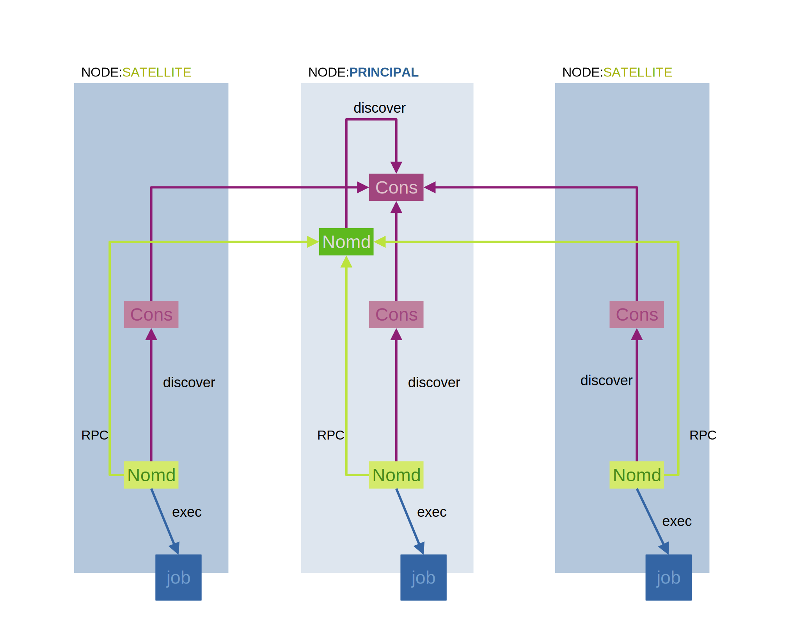

### 0 MODEL: COWAD



- ```Cons```: consul process in server/client mode
- ```Nomd```: nomad process in server/client mode
- ```discover```: services back by jobs are  advertised and discovered within cluster
- ```RPC``` : register membership of nodes within cluster
- ```exec```: job got executed by nomad process in client mode
- ```NODE:PRINCIPAL```: node which run both consul and nomad in server+client mode (control and service discovery)
- ```NODE:SATELLITE```: node which run both consul and nomad in client mode only (handling workload)

### 1 FUNCTIONS
```bash
.funtion/start-server
    # start nomad in server mode

.function/bootstrap-token
    # generate bootstrap token at first time of setup

.funtion/start-client
    # start nomad in client mode
```
