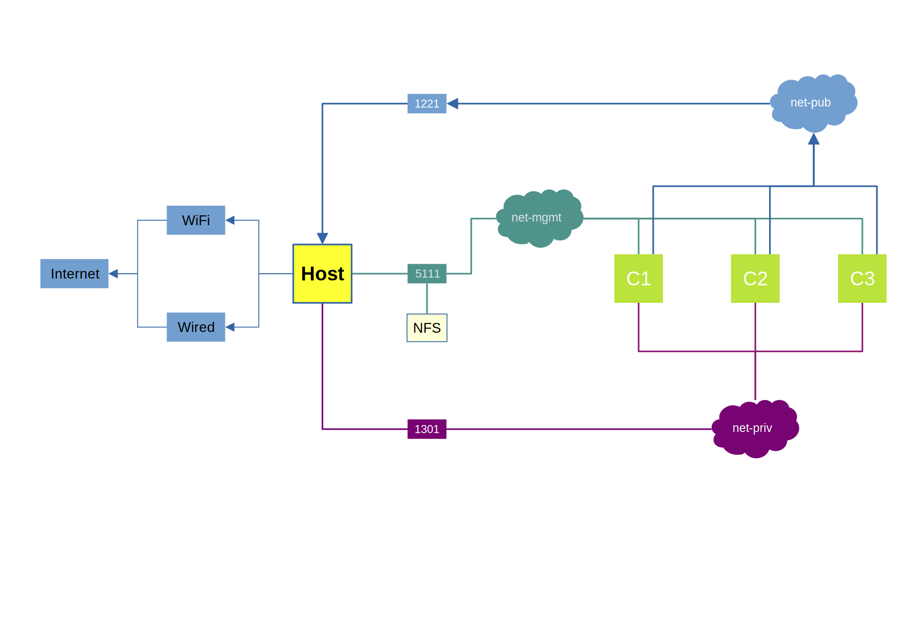

### 0 MODEL: VAGRANT-LIBVIRT



- ```net-priv```: private network , 10.13.0.1/24
- ```net-pub```: public network , 192.168.122.1/24 , libvirt_net ```default```
- ```net-mgmt```: management network , 10.5.11.0/24 , libvirt_net ```vagrant-mgmt```
- ```NFS```: nfs server of shared storage among C* nodes , server/```vagra``` , client/```matrix```
- ```1301```: host-ip in private network , 10.13.0.1
- ```1221```: host-ip in public network , 192.168.122.1
- ```5111```: host-ip in management network , 10.5.11.1
- ```C*```: name of each VM
- ```Host```: physical host of vagrant-libvirt


### 1 FUNCTIONS
```
List all VMs:
    .function/status $NODE_ID

Destroy a VM:
    .function/destroy $NODE_ID

Bring up a VM:
    .function/up $NODE_ID

SSH to a VM:
    .function/ssh $NODE_ID
```


### 2 Mighty Morphin Power Rangers: The Movie (SNES)
```yaml
    - c1 : "red ranger    - rocky"
    - c2 : "blue ranger   - billy"
    - c3 : "pink ranger   - kimberly"
    - c4 : "black ranger  - adam"
    - c5 : "yellow ranger - aisha"
    - c6 : "white ranger  - tommy"
```

